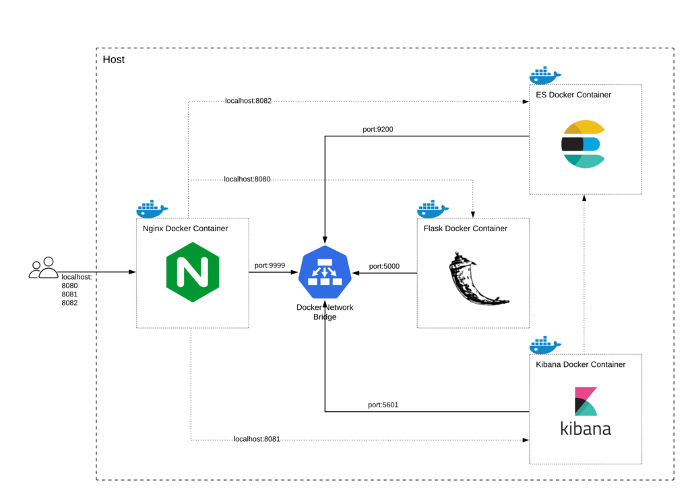

# Containerizing Nginx, Flask, Elasticsearch, and Kibana through Docker network model
The purpose of this project is to spin up a local Elasticsearch - Kibana stack for data analytics. The project provides 
a custom Python - Flask based ETL (Extract-Transform-Load) platform, and uses Nginx as webserver to route client 
traffic to different services. 

Each service is deployed in a standalone container. All the containers join a user-defined docker network 
(`docker bridge`), which allows them to communicate with each other. The user-defined network also improves security by
preventing unrelated services from talking to each other.

## Documentations and Service Links
A detailed API documentation for the `flask-etl` can be found at [/api/v1/about](localhost:8000/api/v1/about).

| Service               	| Nginx reverse proxy 	| Service URL       |
|-----------------------	|---------------------	|----------------	|
| Python Flask ETL      	| localhost:8080      	| localhost:5000 	|
| Elasticsearch Service 	| localhost:8082      	| localhost:9200 	|
| Kibana                	| localhost:8081      	| localhost:5601 	|

## Docker - Quick Start Guide
To build and start docker containers
~~~
docker-compose up --build
~~~
To see all the running containers
~~~
docker ps
~~~
To stop a docker container
~~~
docker stop container-name
~~~

## Docker - Additional Commands
To build an image from Dockerfile with tag, go to the parent folder and run
~~~
docker build -t image-name:version .
~~~
To start docker container from image, run
~~~
docker run -d -p source-port:destination-port image-name:version
~~~
To log into a running docker container
~~~
docker exec -it container_id /bin/bash
~~~

## References
* [Install Elasticsearch with Docker](https://www.elastic.co/guide/en/elasticsearch/reference/current/docker.html)
*[Install NGINX](https://www.nginx.com/resources/wiki/start/topics/tutorials/install/)
